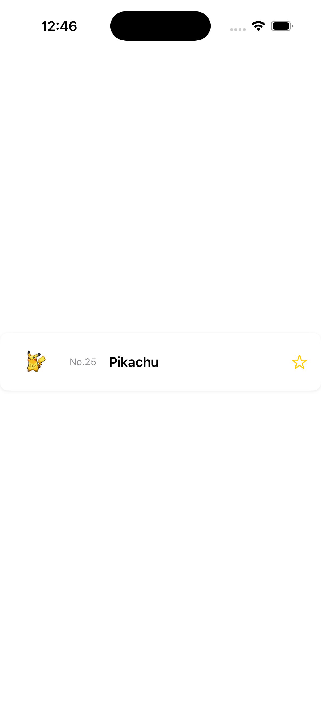

# Step 0: ベースコードを確認しよう

このステップでは、最初に用意されたベースコードを確認します。
コードを実際に動かしながら、どのような仕組みで画面が表示されるのかを理解しましょう。

---

## 📱 アプリを起動してみよう

まずは、用意されたアプリを実行してみましょう。

### 1. プロジェクトを開く
以下の手順で Xcode を起動します。

Finder で `ChallengeProjects/NetworkedApp/` を開いて
`NetworkedApp.xcodeproj` をダブルクリックしてください。

もしくはターミナルを開いて以下のコマンドを入力してください。

```sh
open ChallengeProjects/NetworkedApp/NetworkedApp.xcodeproj
```


### 2. シミュレーターでアプリを実行する
- Xcode の画面左上の **再生ボタン ▶️** を押す。
- シミュレーターにアプリが表示される。
- **ピカチュウのカード** が 1 つ表示されていることを確認する。



---

## 🏗 どのように画面が表示されているのか？

アプリを開くと **ピカチュウの情報が書かれたカード** が 1 つ表示されましたね！
この仕組みを **コードを見ながら** 理解していきましょう。

---

## 📁 プロジェクトのファイル構成

```
NetworkedApp/
├── NetworkedApp.xcodeproj        # Xcodeプロジェクトファイル
├── NetworkedApp/                 # アプリのコード
│   ├── NetworkedApp.swift        # アプリのエントリーポイント
│   ├── PokemonListView.swift     # ポケモンの一覧を表示する画面
│   ├── PokemonItemView.swift     # ポケモン1つ分の表示（アイテムセル）
│   ├── PokemonDetailView.swift   # ポケモンの詳細を表示する画面
│   ├── Pokemon.swift             # ポケモンのデータ構造（構造体）
│   ├── MainTabView.swift         # タブで画面を切り替えるView
│   ├── Assets.xcassets/          # 画像やアイコンを管理する
│   ├── Preview Content/          # Xcodeのプレビュー用のデータ
│   ├── Documents/                # 説明用ドキュメント
│   │   ├── Step0.md              # ワークショップのStep 0に対応する資料
│   │   ├── Step1.md              # ワークショップのStep 1に対応する資料
│   │   ├── Step2.md              # ワークショップのStep 2に対応する資料
│   │   ├── Step3.md              # ワークショップのStep 3に対応する資料
│   │   ├── Step4.md              # ワークショップのStep 4に対応する資料
│   │   └── Step5.md              # ワークショップのStep 5に対応する資料
```

---

## 📌 エントリーポイント（最初に動くコード）を確認しよう

アプリが動き始めるとき、まず **どの画面を表示するのか** を決めるコードが実行されます。
そのコードが **NetworkedApp.swift** に書かれています。

```swift
import SwiftUI

@main
struct NetworkedApp: App {
    var body: some Scene {
        WindowGroup {
            PokemonItemView()
        }
    }
}
```

### このコードの意味
- **`@main`**
  - ここが **アプリのスタート地点** だと Swift に教えるための印。
- **`NetworkedApp: App`**
  - アプリ全体の設定をする **アプリ本体の構造**。
- **`WindowGroup { PokemonItemView() }`**
  - 画面に **PokemonItemView** を表示するように設定している。

つまり、このコードの意味は
**「アプリが起動したら `PokemonItemView` を画面に表示する！」** ということ。

---

## 📌 PokemonItemView のコードを見てみよう

`PokemonItemView.swift` には、**画面に表示するポケモンの情報** のコードが書かれています。
では、コードを見て **どのように画面が作られているのか** を理解していきましょう。

---

### 1️⃣ まずはポケモンのデータを用意する

```swift
let pokemon = PokemonListItem(
    name: "pikachu",
    url: "https://pokeapi.co/api/v2/pokemon/25/"
)
```

#### ここで何をしている？
- **ポケモンの情報** を変数 `pokemon` に保存している。
- `name` には **ポケモンの名前**、「pikachu」が入っている。
- `url` には **ポケモンの API の URL** が入っている。
- この URL の末尾の数字（`25`）が **ポケモンの図鑑番号（ID）** になる。
- ID をもとに、スプライト画像の URL が自動で作られる（`imageURL`）。
- `displayName` で名前の先頭が大文字になる（`pikachu` → `Pikachu`）。

この `pokemon` のデータを **画面に表示する** のが `PokemonItemView` の役割！

---

### 2️⃣ 画面のレイアウトを作る

```swift
var body: some View {
    HStack(spacing: 12) {
        AsyncImage(url: pokemon.imageURL) { phase in
            switch phase {
            case .empty:
                ProgressView()
            case .success(let image):
                image
                    .resizable()
                    .scaledToFit()
            case .failure:
                Image(systemName: "photo")
                    .imageScale(.large)
                    .foregroundStyle(.secondary)
            @unknown default:
                EmptyView()
            }
        }
        .frame(width: 56, height: 56)

        Text("No.\(pokemon.id)")
            .font(.caption)
            .foregroundStyle(.secondary)
            .frame(width: 40)

        Text(pokemon.displayName)
            .font(.body)
            .fontWeight(.semibold)
            .lineLimit(1)

        Spacer()
```

#### ここで何をしている？
- **`HStack(spacing: 12) { ... }`**
  - **横に並ぶレイアウト** を作っている。（HStack = 横方向の並び）
- **`AsyncImage(url: pokemon.imageURL) { ... }`**
  - **インターネットからポケモンのスプライト画像を読み込んで表示** する。
  - 画像が読み込めない場合は **代わりのアイコン** を表示する。
  - `.frame(width: 56, height: 56)` で **56×56ポイント** のサイズに固定している。
- **`Text("No.\(pokemon.id)")`**
  - ポケモンの図鑑番号（例：「No.25」）を **小さめの文字** で表示する。
- **`Text(pokemon.displayName)`**
  - ポケモンの名前（例：「Pikachu」）を **太字** で表示する。
- **`Spacer()`**
  - 名前と星ボタンの間に **空白を入れて** 、星ボタンを右端に寄せている。

---

### 3️⃣ お気に入りボタンの仕組み

```swift
@State private var isFavorite: Bool = false
```

```swift
Button(action: {
    isFavorite.toggle()
}) {
    Image(systemName: isFavorite ? "star.fill" : "star")
        .foregroundStyle(.yellow)
}
.buttonStyle(.plain)
```

#### ここで何をしている？
- **`@State private var isFavorite: Bool = false`**
  - お気に入りの状態を管理する変数。最初は `false`（お気に入りではない）。
  - `@State` をつけることで、値が変わると **画面が自動で更新** される。
- **`Button(action: { isFavorite.toggle() })`**
  - 星のマークを押すと、`isFavorite` が **true/false** に切り替わる。
  - `isFavorite` が **true** のときは **星が塗りつぶされる（star.fill）**。
  - `isFavorite` が **false** のときは **星の輪郭だけ（star）** になる。

---

## 🎯 Step 0 のポイント
- **アプリは `NetworkedApp.swift` から始まる**
  - `WindowGroup { PokemonItemView() }` により、`PokemonItemView` が画面に表示される。
- **`PokemonItemView` でポケモンの情報を画面に表示**
  - `AsyncImage(url:)` で **インターネット上のスプライト画像** を表示。
  - `Text("No.\(pokemon.id)")` で **図鑑番号** を表示。
  - `Text(pokemon.displayName)` で **名前** を表示。
- **ボタンで「お気に入り」を切り替えられる**
  - 星マークを押すと `isFavorite` が変わる。

---

## 🔜 次のステップ
次のステップでは、**ポケモンのアイテムを複数並べてリストを作る** ことに挑戦します！
現在は **1匹のポケモン** だけが表示されているので、次のステップで **複数のポケモンを表示** できるようにしましょう。

➡️ [Step 1 - アイテムセルを複数個縦に並べる](./Step1.md)
