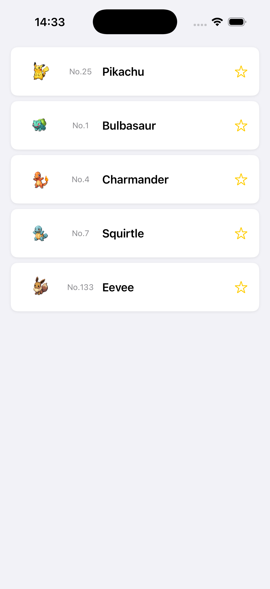

# Step 1: アイテムセルを複数個縦に並べる

## 目的
Step 0 では、 **1匹のポケモン（ピカチュウ）** を画面に表示しました。  
しかし、実際のアプリでは **複数のアイテムをリスト形式で表示** することが一般的です。  

このステップでは、 **複数のポケモンアイテムを縦に並べる** 方法を学びます。  

---

## 📌 やること
1. `PokemonListView` を作成し、複数の `PokemonItemView` を **縦に並べる**
2. **手書きのデータ** を使って、5匹のポケモンアイテムを表示
3. `ScrollView` を使って、リストをスクロール可能にする
4. `LazyVStack` を使って、効率よくアイテムを配置する
5. `PokemonItemView` を修正し、データを外部から受け取る形にする

---

## 画面の完成イメージ
このステップが完了すると、画面に **5匹のポケモン** が並んで表示されます。

```
+----------------------------------------------+
|  🖼  No.25  Pikachu                      ☆  |
+----------------------------------------------+
|  🖼  No.1   Bulbasaur                    ☆  |
+----------------------------------------------+
|  🖼  No.4   Charmander                   ☆  |
+----------------------------------------------+
|  🖼  No.7   Squirtle                     ☆  |
+----------------------------------------------+
|  🖼  No.133 Eevee                        ☆  |
+----------------------------------------------+
```



---

## 🏗 実装手順

### 1. `PokemonListView` を作成（すでに用意しています）
Step 0 では、アプリの最初の画面として `PokemonItemView` を **1つだけ** 表示していました。  
今回は **リスト形式** にするため、`PokemonListView.swift` の中に、`PokemonItemView` を **5つ** 並べます。

```swift
import SwiftUI

struct PokemonListView: View {

    var body: some View {
        ScrollView {
            LazyVStack(spacing: 8) {
                PokemonItemView()
                    .padding(.horizontal)
                PokemonItemView()
                    .padding(.horizontal)
                PokemonItemView()
                    .padding(.horizontal)
                PokemonItemView()
                    .padding(.horizontal)
                PokemonItemView()
                    .padding(.horizontal)
            }
            .padding(.vertical, 8)
        }
        .background(Color(.systemGroupedBackground))
    }
}

#Preview {
    PokemonListView()
}
```

---

### 2. `PokemonItemView` の変更
これまでは、`PokemonItemView` の中で **固定のポケモン情報** を持っていました。  
しかし、リスト形式にするため、 **外部からポケモンデータを受け取る形** に変更します。

#### **変更前の `PokemonItemView`**
```swift
struct PokemonItemView: View {
    let pokemon = Pokemon(
        name: "pikachu",
        url: "https://pokeapi.co/api/v2/pokemon/25/"
    )
```
この書き方では、**毎回同じポケモン（ピカチュウ）が表示されてしまう** ため、  
表示する内容を変えられるように変更します。

#### **変更後の `PokemonItemView`**

```swift
struct PokemonItemView: View {
    let pokemon: Pokemon
```

- `let pokemon = Pokemon(...)` を削除  
- `let pokemon: Pokemon` に変更  
- これにより、**外部からデータを受け取ることができる**

この変更に伴って、Preview の記述も変更する必要があります。

```swift
#Preview {
    let pokemon = Pokemon(
        name: "pikachu",
        url: "https://pokeapi.co/api/v2/pokemon/25/"
    )

    PokemonItemView(pokemon: pokemon)
        .padding(.horizontal)
}
```

---

### 3. ポケモンデータを 5 つ用意する
`PokemonListView` の中に、**5匹のポケモンデータ** を定義します。

```swift
struct PokemonListView: View {
    let pokemon1 = Pokemon(
        name: "pikachu",
        url: "https://pokeapi.co/api/v2/pokemon/25/"
    )
    let pokemon2 = Pokemon(
        name: "bulbasaur",
        url: "https://pokeapi.co/api/v2/pokemon/1/"
    )
    let pokemon3 = Pokemon(
        name: "charmander",
        url: "https://pokeapi.co/api/v2/pokemon/4/"
    )
    let pokemon4 = Pokemon(
        name: "squirtle",
        url: "https://pokeapi.co/api/v2/pokemon/7/"
    )
    let pokemon5 = Pokemon(
        name: "eevee",
        url: "https://pokeapi.co/api/v2/pokemon/133/"
    )
```

---

### 4. `LazyVStack` でアイテムを縦に並べる

複数のアイテムを **縦に並べる** ために、`LazyVStack` を使います。

```swift
    var body: some View {
        ScrollView {
            LazyVStack(spacing: 8) {
                PokemonItemView(pokemon: pokemon1)
                    .padding(.horizontal)

                PokemonItemView(pokemon: pokemon2)
                    .padding(.horizontal)

                PokemonItemView(pokemon: pokemon3)
                    .padding(.horizontal)

                PokemonItemView(pokemon: pokemon4)
                    .padding(.horizontal)

                PokemonItemView(pokemon: pokemon5)
                    .padding(.horizontal)
            }
            .padding(.vertical, 8)
        }
        .background(Color(.systemGroupedBackground))
    }
}
```

---

### 5. `NetworkedApp.swift` を更新する
今までは **1匹のポケモン** しか表示していませんでした。  
このステップから、アプリの最初の画面を `PokemonListView` に変更します。

```swift
import SwiftUI

@main
struct NetworkedApp: App {
    var body: some Scene {
        WindowGroup {
            PokemonListView()
        }
    }
}
```

---

## 🎯 Step 1 のポイント
1. **複数のアイテムを手動で並べた**
   - `PokemonItemView` を **5つ** 画面に表示した。
2. **`ScrollView` を追加**
   - **スクロール可能** にしたので、すべてのアイテムを表示できるようになった。
3. **`LazyVStack` を使った**
   - アイテムが **縦に並ぶように配置** した。
4. **`PokemonItemView` を変更**
   - 外部から `Pokemon` のデータを受け取るようにした。

---

## ✅ 完成後のコード

### `PokemonItemView.swift`
```swift
import SwiftUI

struct PokemonItemView: View {
    let pokemon: Pokemon

    @State private var isFavorite: Bool = false

    var body: some View {
        HStack(spacing: 12) {
            AsyncImage(url: pokemon.imageURL) { phase in
                switch phase {
                case .empty:
                    ProgressView()
                case .success(let image):
                    image
                        .resizable()
                        .scaledToFit()
                case .failure:
                    Image(systemName: "photo")
                        .imageScale(.large)
                        .foregroundStyle(.secondary)
                @unknown default:
                    EmptyView()
                }
            }
            .frame(width: 56, height: 56)

            Text("No.\(pokemon.id)")
                .font(.caption)
                .foregroundStyle(.secondary)
                .frame(width: 40)

            Text(pokemon.displayName)
                .font(.body)
                .fontWeight(.semibold)
                .lineLimit(1)

            Spacer()

            Button(action: {
                isFavorite.toggle()
            }) {
                Image(systemName: isFavorite ? "star.fill" : "star")
                    .foregroundStyle(.yellow)
            }
            .buttonStyle(.plain)
        }
        .padding(.horizontal)
        .padding(.vertical, 8)
        .background(Color(.systemBackground))
        .clipShape(RoundedRectangle(cornerRadius: 10))
        .shadow(color: .black.opacity(0.08), radius: 2, y: 1)
    }
}

#Preview {
    let pokemon = Pokemon(
        name: "pikachu",
        url: "https://pokeapi.co/api/v2/pokemon/25/"
    )
    PokemonItemView(pokemon: pokemon)
        .padding(.horizontal)
}
```

---

### `PokemonListView.swift`
```swift
import SwiftUI

struct PokemonListView: View {
    let pokemon1 = Pokemon(
        name: "pikachu",
        url: "https://pokeapi.co/api/v2/pokemon/25/"
    )
    let pokemon2 = Pokemon(
        name: "bulbasaur",
        url: "https://pokeapi.co/api/v2/pokemon/1/"
    )
    let pokemon3 = Pokemon(
        name: "charmander",
        url: "https://pokeapi.co/api/v2/pokemon/4/"
    )
    let pokemon4 = Pokemon(
        name: "squirtle",
        url: "https://pokeapi.co/api/v2/pokemon/7/"
    )
    let pokemon5 = Pokemon(
        name: "eevee",
        url: "https://pokeapi.co/api/v2/pokemon/133/"
    )

    var body: some View {
        ScrollView {
            LazyVStack(spacing: 8) {
                PokemonItemView(pokemon: pokemon1)
                    .padding(.horizontal)

                PokemonItemView(pokemon: pokemon2)
                    .padding(.horizontal)

                PokemonItemView(pokemon: pokemon3)
                    .padding(.horizontal)

                PokemonItemView(pokemon: pokemon4)
                    .padding(.horizontal)

                PokemonItemView(pokemon: pokemon5)
                    .padding(.horizontal)
            }
            .padding(.vertical, 8)
        }
        .background(Color(.systemGroupedBackground))
    }
}

#Preview {
    PokemonListView()
}
```

---

### `NetworkedApp.swift`
```swift
import SwiftUI

@main
struct NetworkedApp: App {
    var body: some Scene {
        WindowGroup {
            PokemonListView()
        }
    }
}
```

---

## 🔜 次のステップ
現在は、ポケモンアイテムを **手動で 5つ** 並べています。
次のステップでは、 **`ForEach` を使って自動的にリストを作成** できるようにします！

➡️ [Step 2 - ForEach を使ってリストを整理する](./Step2.md)
