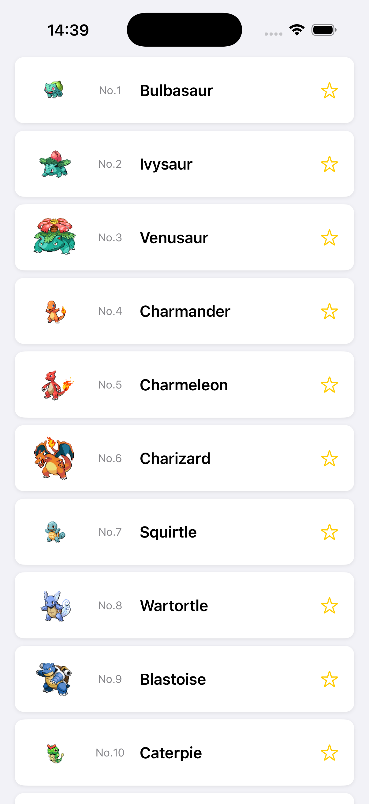

# Step 3 - API経由で情報を取得して表示する

## 🎯 目的
Step 2 では、手書きのデータを使って `PokemonItemView` をリストに表示しました。  
しかし、実際のアプリでは、サーバー（クラウド）からデータを取得して表示することが一般的です。  

このステップでは、**インターネットを使って、サーバー上のデータを取得し、リストに表示する方法** を学びます。



---

## 📌 何をするの？
1. **`Pokemon.swift` のモデルを確認する**
   - API（サーバー）から受け取るデータを扱うための構造体を理解する
2. **`getPokemons()` メソッドを作る**
   - サーバーからデータを取得するための関数を実装
3. **画面が表示されたときにデータを取得する**
   - `.task {}` を使って、画面が表示されたら自動で `getPokemons()` を実行
4. **取得したデータをリストに表示する**
   - `@State` を使ってリストを動的に更新する

---

## 🤔 APIって何？
API（エーピーアイ）とは、**アプリとサーバーがデータをやり取りするための仕組み** です。  

今回のワークショップでは、**PokeAPI** という無料のポケモンAPIを使います。

```
https://pokeapi.co/api/v2/pokemon?limit=151
```

このURLにアクセスすると、次のような **JSONデータ** が取得できます。

```json
{
    "results": [
        {
            "name": "bulbasaur",
            "url": "https://pokeapi.co/api/v2/pokemon/1/"
        },
        {
            "name": "ivysaur",
            "url": "https://pokeapi.co/api/v2/pokemon/2/"
        },
        {
            "name": "venusaur",
            "url": "https://pokeapi.co/api/v2/pokemon/3/"
        }
    ]
}
```

🔹 **JSON（ジェイソン）とは？**  
JSON は **データの形（フォーマット）** のひとつです。  
- 文章のように見えますが、実は **プログラムが読みやすい形式** になっています。
- Swift の `Dictionary` や `Array` に変換することで、アプリで使えるようになります。

🔹 **PokeAPI について**  
- 初代ポケモン151匹のデータを取得できます。
- `results` 配列の中に、各ポケモンの `name`（名前）と `url`（詳細ページのURL）が入っています。
- `url` の末尾の数字がポケモンのID（図鑑番号）になっています。

---

## ✅ APIからデータを取得する流れ
APIを使ってデータを取得するには、次の手順が必要です。

1. **`Pokemon.swift` にあるモデル構造体を確認する**
   - APIから取得したデータを `Pokemon` の形に変換できるようになっている
2. **`getPokemons()` 関数を作る**
   - API からデータを取得し、`Pokemon` に変換する関数を作る
3. **`PokemonListView.swift` を更新する**
   - `.task {}` を使って、データを取得し、リストを更新する
4. **取得したデータを `@State` で管理**
   - `@State` を使ってリストを動的に更新する

---

## 🛠 実装手順

### 1. `Pokemon.swift` のモデルを確認する
まず、`Pokemon.swift` にすでに定義されている構造体を確認しましょう。  
今回使うのは `Pokemon`、`PokemonListResponse`、`PokemonListEntry` です。

**確認するファイル: `Pokemon.swift`**

```swift
import Foundation

// ポケモンのデータ構造
struct Pokemon: Identifiable {
    let id: Int
    let name: String

    var displayName: String { name.capitalized }
    var imageURL: URL? {
        URL(string: "https://raw.githubusercontent.com/PokeAPI/sprites/master/sprites/pokemon/\(id).png")
    }
}

// リストAPI用（/pokemon?limit=151 のレスポンス）
struct PokemonListResponse: Decodable {
    let results: [PokemonListEntry]
}

// APIレスポンスの1件分（name と url のみ）
struct PokemonListEntry: Decodable {
    let name: String
    let url: String

    // PokemonListEntry → Pokemon に変換する
    func toPokemon() -> Pokemon {
        let parts = url.split(separator: "/")
        let id = Int(parts.last ?? "") ?? 0
        return Pokemon(id: id, name: name)
    }
}
```

🔹 **ポイント**
- `Pokemon` はアプリで使うポケモンのデータ構造です。`id`（図鑑番号）と `name`（名前）を持っています。
- `PokemonListResponse` は API のレスポンス全体を表す構造体です。`results` の中にポケモン一覧が入っています。
- `PokemonListEntry` は API レスポンスの1件分です。`Decodable` がついているので、JSON を自動で変換できます。
- `toPokemon()` で API のデータをアプリで使う `Pokemon` に変換します。
- `imageURL` でポケモンの画像を取得できます。

---

### 2. `getPokemons()` メソッドを作成する
APIからデータを取得する関数 `getPokemons()` を **`PokemonListView.swift` の中に作成** します。

**編集するファイル: `PokemonListView.swift`**  
1. `PokemonListView` の中に、次のメソッドを追加してください。

```swift
func getPokemons() async throws -> [Pokemon] {
    guard let url = URL(string: "https://pokeapi.co/api/v2/pokemon?limit=151") else { return [] }

    let (data, _) = try await URLSession.shared.data(from: url)

    let response = try JSONDecoder().decode(PokemonListResponse.self, from: data)

    return response.results.map { $0.toPokemon() }
}
```

🔹 **このコードの意味**
1. `URL(string:)` で APIのURL を作成
2. `URLSession.shared.data(from:)` で **サーバーからデータを取得**
3. `JSONDecoder().decode(PokemonListResponse.self, from: data)` で **データを `PokemonListResponse` に変換**
4. `response.results.map { $0.toPokemon() }` で API のレスポンスを `Pokemon` に変換して返す

---

### 3. `PokemonListView.swift` を更新する
画面表示時に `getPokemons()` を実行し、取得したデータをリストに表示します。

**編集するファイル: `PokemonListView.swift`**

```swift
import SwiftUI

struct PokemonListView: View {
    @State private var pokemons: [Pokemon] = []

    var body: some View {
        ScrollView {
            LazyVStack(spacing: 8) {
                ForEach(pokemons) { pokemon in
                    PokemonItemView(pokemon: pokemon)
                        .padding(.horizontal)
                }
            }
            .padding(.vertical, 8)
        }
        .background(Color(.systemGroupedBackground))
        .task {
            do {
                pokemons = try await getPokemons()
            } catch {
                print("Failed to fetch pokemons: \(error)")
            }
        }
    }
}

#Preview {
    PokemonListView()
}
```

🔹 **追加したポイント**
- `@State private var pokemons: [Pokemon] = []`
  - 取得したデータを保存するための変数
- `ForEach(pokemons)` を使って、配列の中のポケモンを1つずつ `PokemonItemView` に表示
- `.task {}` を追加
  - 画面が表示されたときに、`getPokemons()` を実行してデータを取得

---

### 4. `PokemonItemView.swift` の変更
`PokemonItemView` がポケモンのデータを外から受け取れるように修正します。  
今まではハードコードされた `pikachu` のデータを使っていましたが、引数で受け取るように変更します。

**編集するファイル: `PokemonItemView.swift`**

ハードコードされていた `let pokemon = Pokemon(...)` の行を、次のように変更してください。

```swift
let pokemon: Pokemon
```

これで、外から `PokemonItemView(pokemon: pokemon)` のようにデータを渡せるようになります。

---

### 5. `NetworkedApp.swift` の変更
アプリのエントリーポイントで `PokemonListView` を使うようにします。

**編集するファイル: `NetworkedApp.swift`**

```swift
import SwiftUI

@main
struct NetworkedApp: App {
    var body: some Scene {
        WindowGroup {
            PokemonListView()
        }
    }
}
```

---

## ✅ 完成後のコード

### `Pokemon.swift`
```swift
import Foundation

// ポケモンのデータ構造
struct Pokemon: Identifiable {
    let id: Int
    let name: String

    var displayName: String { name.capitalized }
    var imageURL: URL? {
        URL(string: "https://raw.githubusercontent.com/PokeAPI/sprites/master/sprites/pokemon/\(id).png")
    }
}

// リストAPI用（/pokemon?limit=151 のレスポンス）
struct PokemonListResponse: Decodable {
    let results: [PokemonListEntry]
}

// APIレスポンスの1件分（name と url のみ）
struct PokemonListEntry: Decodable {
    let name: String
    let url: String

    func toPokemon() -> Pokemon {
        let parts = url.split(separator: "/")
        let id = Int(parts.last ?? "") ?? 0
        return Pokemon(id: id, name: name)
    }
}

// 詳細API用（/pokemon/{id} のレスポンスから必要なものだけ）
struct PokemonDetail: Decodable {
    let id: Int
    let name: String
    let height: Int
    let weight: Int
    let types: [TypeSlot]

    struct TypeSlot: Decodable {
        let type: TypeInfo
    }

    struct TypeInfo: Decodable {
        let name: String
    }
}
```

---

### `PokemonListView.swift`
```swift
import SwiftUI

struct PokemonListView: View {
    @State private var pokemons: [Pokemon] = []

    var body: some View {
        ScrollView {
            LazyVStack(spacing: 8) {
                ForEach(pokemons) { pokemon in
                    PokemonItemView(pokemon: pokemon)
                        .padding(.horizontal)
                }
            }
            .padding(.vertical, 8)
        }
        .background(Color(.systemGroupedBackground))
        .task {
            do {
                pokemons = try await getPokemons()
            } catch {
                print("Failed to fetch pokemons: \(error)")
            }
        }
    }

    func getPokemons() async throws -> [Pokemon] {
        guard let url = URL(string: "https://pokeapi.co/api/v2/pokemon?limit=151") else { return [] }
        let (data, _) = try await URLSession.shared.data(from: url)
        let response = try JSONDecoder().decode(PokemonListResponse.self, from: data)
        return response.results.map { $0.toPokemon() }
    }
}

#Preview {
    PokemonListView()
}
```

---

## ⏭️ 次のステップ
次は、 **リストのアイテムをタップして詳細画面へ遷移** する方法を学びます！

➡️ [Step 4 - アイテムをタップしたらアイテム詳細画面へ遷移してみよう](./Step4.md)
