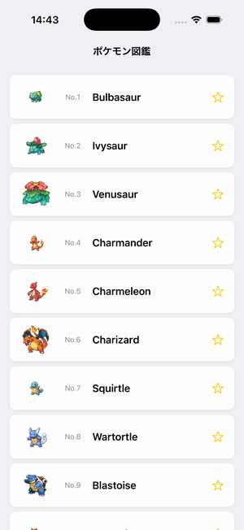

# Step 4 - アイテムをタップしたらアイテム詳細画面へ遷移してみよう

## 🎯 目的
Step 3 では、サーバー（API）から取得したポケモンのデータをリスト形式で画面に表示しました。
しかし、今の状態では、ポケモンの詳細情報を確認することができません。

このステップでは、**リストのアイテムをタップすると詳細画面に遷移する機能** を追加します。



---

## 📌 何をするの？
1. **`NavigationStack` を追加して、画面遷移を管理する**
2. **`NavigationLink` を使って、アイテムをタップすると詳細画面へ移動できるようにする**
3. **詳細画面 `PokemonDetailView` を作成し、ポケモンの詳細情報を表示する**

---

## `NavigationStack` と `NavigationLink` の説明

### NavigationStack
- 役割:
  - 画面遷移の階層構造を管理するためのコンテナ。
  - 親画面から子画面への遷移や、戻るボタンの操作を自動でサポートします。
- 使い方:
  - 他のビューを`NavigationStack`内に配置するだけで、簡単に遷移可能な構造を作れます。
  - 例:
    ```swift
    NavigationStack {
        Text("This is the main view")
    }
    ```

### NavigationLink
- 役割:
  - タップなどのアクションで別のビューに遷移するリンクを作成。
  - 遷移先のビューを`destination`パラメータで指定します。
- 使い方:
  - タップ可能な要素（例: `Text`, `Button`など）を`NavigationLink`でラップして使用します。
  - 例:
    ```swift
    NavigationStack {
        NavigationLink(destination: Text("Detail View")) {
            Text("Go to Detail")
        }
        .padding()
    }
    ```

---

## 🛠 実装手順

### 1. `NavigationStack` と `NavigationLink` を追加する
画面遷移を管理するために、`PokemonListView` を **`NavigationStack`** で囲み、  
各アイテムを **`NavigationLink`** でラップします。

**編集するファイル: `PokemonListView.swift`**

```swift
import SwiftUI

struct PokemonListView: View {
    @State private var pokemons: [Pokemon] = [] // サーバーから取得するポケモン一覧データ

    var body: some View {
        NavigationStack { // ← NavigationStackを追加して画面遷移を管理
            ScrollView {
                LazyVStack(spacing: 8) {
                    ForEach(pokemons) { pokemon in
                        NavigationLink(destination: PokemonDetailView(pokemon: pokemon)) {
                            // ← アイテムをタップすると詳細画面へ遷移
                            PokemonItemView(pokemon: pokemon)
                                .padding(.horizontal)
                        }
                        .buttonStyle(.plain) // ← デフォルトの青色リンクスタイルを無効化
                    }
                }
                .padding(.vertical, 8)
            }
            .background(Color(.systemGroupedBackground))
            .navigationTitle("ポケモン図鑑") // ← 画面上部にタイトルを追加
            .navigationBarTitleDisplayMode(.inline)
        }
        .task {
            do {
                pokemons = try await getPokemons()
            } catch {
                print("Failed to fetch pokemons: \(error)")
            }
        }
    }

    // MARK: - APIデータ取得メソッド
    func getPokemons() async throws -> [Pokemon] {
        guard let url = URL(string: "https://pokeapi.co/api/v2/pokemon?limit=151") else { return [] }
        let (data, _) = try await URLSession.shared.data(from: url)
        let response = try JSONDecoder().decode(PokemonListResponse.self, from: data)
        return response.results.map { $0.toPokemon() }
    }
}

#Preview {
    PokemonListView()
}
```

🔹 **追加したポイント**
- `NavigationStack {}` で **全体を包む** ことで、画面遷移を管理できるようになった
- `.navigationTitle("ポケモン図鑑")` で **画面の上部にタイトル** を追加した
- `.navigationBarTitleDisplayMode(.inline)` で **タイトルをコンパクトに表示**
- `NavigationLink(destination: PokemonDetailView(pokemon: pokemon))` を使って、
  **アイテムをタップすると詳細画面に移動するようにした**
- `.buttonStyle(.plain)` を追加して、**リンクの青色スタイルを無効化** した

---

### 2. `PokemonDetailView` を作成する
詳細画面を表示する `PokemonDetailView.swift` を **編集** し、
選択されたポケモンの詳細情報を表示できるようにします。

**編集するファイル: `PokemonDetailView.swift`**

```swift
import SwiftUI

struct PokemonDetailView: View {
    let pokemon: Pokemon
    @State private var detail: PokemonDetail?

    var body: some View {
        ScrollView {
            VStack(spacing: 20) {
                // ポケモン画像（大きめ）
                AsyncImage(url: pokemon.imageURL) { phase in
                    switch phase {
                    case .empty:
                        ProgressView()
                    case .success(let image):
                        image
                            .resizable()
                            .scaledToFit()
                    case .failure:
                        Image(systemName: "photo")
                            .imageScale(.large)
                            .foregroundStyle(.secondary)
                    @unknown default:
                        EmptyView()
                    }
                }
                .frame(width: 200, height: 200)

                // 名前と番号
                Text("No.\(pokemon.id)")
                    .font(.subheadline)
                    .foregroundStyle(.secondary)
                Text(pokemon.displayName)
                    .font(.largeTitle)
                    .fontWeight(.bold)

                // 詳細情報（API取得後に表示）
                if let detail {
                    // タイプ
                    HStack {
                        ForEach(detail.types, id: \.type.name) { typeSlot in
                            Text(typeSlot.type.name.capitalized)
                                .font(.subheadline)
                                .fontWeight(.semibold)
                                .padding(.horizontal, 16)
                                .padding(.vertical, 8)
                                .background(Color.blue.opacity(0.2))
                                .clipShape(Capsule())
                        }
                    }

                    // 高さ・重さ
                    HStack(spacing: 40) {
                        VStack {
                            Text("高さ")
                                .font(.caption)
                                .foregroundStyle(.secondary)
                            Text(String(format: "%.1f m", Double(detail.height) / 10.0))
                                .font(.title3)
                                .fontWeight(.semibold)
                        }
                        VStack {
                            Text("重さ")
                                .font(.caption)
                                .foregroundStyle(.secondary)
                            Text(String(format: "%.1f kg", Double(detail.weight) / 10.0))
                                .font(.title3)
                                .fontWeight(.semibold)
                        }
                    }
                    .padding()
                    .background(Color(.systemGray6))
                    .clipShape(RoundedRectangle(cornerRadius: 12))
                }
            }
            .padding()
        }
        .navigationTitle(pokemon.displayName)
        .navigationBarTitleDisplayMode(.inline)
        .task {
            do {
                detail = try await getPokemonDetail()
            } catch {
                print("Failed to fetch pokemon detail: \(error)")
            }
        }
    }

    // MARK: - APIデータ取得メソッド
    func getPokemonDetail() async throws -> PokemonDetail {
        guard let url = URL(string: "https://pokeapi.co/api/v2/pokemon/\(pokemon.id)") else {
            throw URLError(.badURL)
        }
        let (data, _) = try await URLSession.shared.data(from: url)
        return try JSONDecoder().decode(PokemonDetail.self, from: data)
    }
}

#Preview {
    NavigationStack {
        PokemonDetailView(
            pokemon: Pokemon(
                name: "pikachu",
                url: "https://pokeapi.co/api/v2/pokemon/25/"
            )
        )
    }
}
```

🔹 **このコードのポイント**
- `let pokemon: Pokemon` で、リスト画面から選択されたポケモンのデータを受け取る
- `@State private var detail: PokemonDetail?` で、詳細APIから取得したデータを保存
- `.task {}` で画面表示時に `getPokemonDetail()` を実行し、詳細情報を取得
- `AsyncImage` でポケモンの画像を大きめ（200x200）に表示
- `if let detail` で、API取得が完了してから詳細情報（タイプ・高さ・重さ）を表示
- `getPokemonDetail()` は `/pokemon/{id}` のAPIエンドポイントからデータを取得

🔹 **`getPokemonDetail()` の意味**
1. `URL(string:)` で `/pokemon/{id}` のURLを作成
2. `URLSession.shared.data(from:)` で **サーバーからデータを取得**
3. `JSONDecoder().decode(PokemonDetail.self, from: data)` で **データを `PokemonDetail` に変換**

---

### 3. `NetworkedApp.swift` の変更
アプリのエントリーポイントで `PokemonListView` を使うようにします。

**編集するファイル: `NetworkedApp.swift`**

```swift
import SwiftUI

@main
struct NetworkedApp: App {
    var body: some Scene {
        WindowGroup {
            PokemonListView() // ← アプリ起動時にリスト画面を表示
        }
    }
}
```

---

## ✅ 完成後のコード

### `PokemonListView.swift`
```swift
import SwiftUI

struct PokemonListView: View {
    @State private var pokemons: [Pokemon] = []

    var body: some View {
        NavigationStack {
            ScrollView {
                LazyVStack(spacing: 8) {
                    ForEach(pokemons) { pokemon in
                        NavigationLink(destination: PokemonDetailView(pokemon: pokemon)) {
                            PokemonItemView(pokemon: pokemon)
                                .padding(.horizontal)
                        }
                        .buttonStyle(.plain)
                    }
                }
                .padding(.vertical, 8)
            }
            .background(Color(.systemGroupedBackground))
            .navigationTitle("ポケモン図鑑")
            .navigationBarTitleDisplayMode(.inline)
        }
        .task {
            do {
                pokemons = try await getPokemons()
            } catch {
                print("Failed to fetch pokemons: \(error)")
            }
        }
    }

    func getPokemons() async throws -> [Pokemon] {
        guard let url = URL(string: "https://pokeapi.co/api/v2/pokemon?limit=151") else { return [] }
        let (data, _) = try await URLSession.shared.data(from: url)
        let response = try JSONDecoder().decode(PokemonListResponse.self, from: data)
        return response.results.map { $0.toPokemon() }
    }
}

#Preview {
    PokemonListView()
}
```

---

### `PokemonDetailView.swift`
```swift
import SwiftUI

struct PokemonDetailView: View {
    let pokemon: Pokemon
    @State private var detail: PokemonDetail?

    var body: some View {
        ScrollView {
            VStack(spacing: 20) {
                // ポケモン画像（大きめ）
                AsyncImage(url: pokemon.imageURL) { phase in
                    switch phase {
                    case .empty:
                        ProgressView()
                    case .success(let image):
                        image
                            .resizable()
                            .scaledToFit()
                    case .failure:
                        Image(systemName: "photo")
                            .imageScale(.large)
                            .foregroundStyle(.secondary)
                    @unknown default:
                        EmptyView()
                    }
                }
                .frame(width: 200, height: 200)

                Text("No.\(pokemon.id)")
                    .font(.subheadline)
                    .foregroundStyle(.secondary)
                Text(pokemon.displayName)
                    .font(.largeTitle)
                    .fontWeight(.bold)

                if let detail {
                    HStack {
                        ForEach(detail.types, id: \.type.name) { typeSlot in
                            Text(typeSlot.type.name.capitalized)
                                .font(.subheadline)
                                .fontWeight(.semibold)
                                .padding(.horizontal, 16)
                                .padding(.vertical, 8)
                                .background(Color.blue.opacity(0.2))
                                .clipShape(Capsule())
                        }
                    }

                    HStack(spacing: 40) {
                        VStack {
                            Text("高さ")
                                .font(.caption)
                                .foregroundStyle(.secondary)
                            Text(String(format: "%.1f m", Double(detail.height) / 10.0))
                                .font(.title3)
                                .fontWeight(.semibold)
                        }
                        VStack {
                            Text("重さ")
                                .font(.caption)
                                .foregroundStyle(.secondary)
                            Text(String(format: "%.1f kg", Double(detail.weight) / 10.0))
                                .font(.title3)
                                .fontWeight(.semibold)
                        }
                    }
                    .padding()
                    .background(Color(.systemGray6))
                    .clipShape(RoundedRectangle(cornerRadius: 12))
                }
            }
            .padding()
        }
        .navigationTitle(pokemon.displayName)
        .navigationBarTitleDisplayMode(.inline)
        .task {
            do {
                detail = try await getPokemonDetail()
            } catch {
                print("Failed to fetch pokemon detail: \(error)")
            }
        }
    }

    func getPokemonDetail() async throws -> PokemonDetail {
        guard let url = URL(string: "https://pokeapi.co/api/v2/pokemon/\(pokemon.id)") else {
            throw URLError(.badURL)
        }
        let (data, _) = try await URLSession.shared.data(from: url)
        return try JSONDecoder().decode(PokemonDetail.self, from: data)
    }
}

#Preview {
    NavigationStack {
        PokemonDetailView(
            pokemon: Pokemon(
                name: "pikachu",
                url: "https://pokeapi.co/api/v2/pokemon/25/"
            )
        )
    }
}
```

---

## ⏭️ 次のステップ
次は、 **タブを追加して、画面を切り替えられるようにする** 方法を学びます！

➡️ [Step 5 - タブを利用して複数の画面を切り替えよう](./Step5.md)
