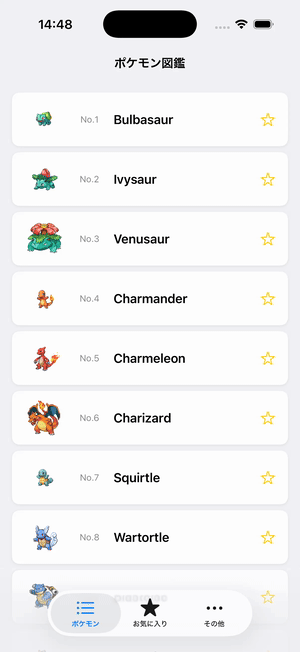

# Step 5 - タブを利用して複数の画面を切り替えよう

## 🎯 目的

今までは **1つの画面** しかなかったため、アプリの中で **別の画面に移動する方法** は `NavigationLink` を使った **詳細画面の遷移** だけでした。  

しかし、実際のアプリでは **タブバーを使って複数の画面を簡単に切り替えられる** ようにすることが多いです。  

このステップでは **タブバー（TabView）を追加して、画面を切り替える** 方法を学びます。  



---

## 📌 何をするの？

1. **`MainTabView` を新しく作成し、アプリのナビゲーションを管理する**
2. **`TabView` を使って、タブで画面を切り替えられるようにする**
3. **ポケモン一覧 (`PokemonListView`)、お気に入り、その他 をタブとして表示する**
4. **エントリーポイント (`NetworkedApp`) を更新し、アプリ起動時に `MainTabView` を表示する**

---

## 📖 タブバー (`TabView`) とは？

タブバー（`TabView`）は、アプリ内で複数の画面を切り替えるための **ナビゲーションコンポーネント** です。

`TabView` を使うと、 **画面の下にタブが表示され**、タップすると別の画面に切り替えられます。

---

## 🏗 実装手順

### 1. `MainTabView` を作成する

アプリ全体を管理する **`MainTabView.swift`** を編集し、  
`TabView` を使って画面を切り替えられるようにします。

📌 **編集するファイル: `MainTabView.swift`**

```swift
import SwiftUI

struct MainTabView: View {
    var body: some View {
        TabView {
            // ポケモンリスト画面
            PokemonListView()
                .tabItem {
                    Image(systemName: "list.bullet") // タブのアイコン
                    Text("ポケモン") // タブのラベル
                }

            // お気に入り画面（仮置き）
            Text("お気に入り")
                .tabItem {
                    Image(systemName: "star.fill") // タブのアイコン
                    Text("お気に入り") // タブのラベル
                }

            // その他画面（仮置き）
            Text("その他")
                .tabItem {
                    Image(systemName: "ellipsis") // タブのアイコン
                    Text("その他") // タブのラベル
                }
        }
    }
}

#Preview {
    MainTabView()
}
```

📌 **追加したポイント**
- `TabView {}` を使って、 **タブのあるレイアウト** を作成。
- `.tabItem {}` を使って、 **各タブにアイコンとタイトル** を設定。
- **ポケモンリスト (`PokemonListView`)** を **最初のタブ** に設定。
- **お気に入り画面はまだ未実装のため**、仮の `Text("お気に入り")` を表示。
- **その他画面も仮の `Text("その他")` を表示**。あとから自由にカスタマイズできます。

---

### 2. `NetworkedApp.swift` を変更する

今までは **`PokemonListView` を直接表示** していましたが、  
今回の変更で **タブバー (`MainTabView`) をアプリの起動時に表示する** ようにします。

📌 **編集するファイル: `NetworkedApp.swift`**

```swift
import SwiftUI

@main
struct NetworkedApp: App {
    var body: some Scene {
        WindowGroup {
            MainTabView() // ← ここを変更（アプリ起動時に `MainTabView` を表示）
        }
    }
}
```

📌 **変更したポイント**
- `PokemonListView()` → `MainTabView()` に変更
- これで **アプリ起動時にタブバーが表示される**

---

## ✅ 完成後のコード

### `MainTabView.swift`

```swift
import SwiftUI

struct MainTabView: View {
    var body: some View {
        TabView {
            // ポケモンリスト画面
            PokemonListView()
                .tabItem {
                    Image(systemName: "list.bullet") // タブのアイコン
                    Text("ポケモン") // タブのラベル
                }

            // お気に入り画面（仮置き）
            Text("お気に入り")
                .tabItem {
                    Image(systemName: "star.fill") // タブのアイコン
                    Text("お気に入り") // タブのラベル
                }

            // その他画面（仮置き）
            Text("その他")
                .tabItem {
                    Image(systemName: "ellipsis") // タブのアイコン
                    Text("その他") // タブのラベル
                }
        }
    }
}

#Preview {
    MainTabView()
}
```

---

### `NetworkedApp.swift`

```swift
import SwiftUI

@main
struct NetworkedApp: App {
    var body: some Scene {
        WindowGroup {
            MainTabView()
        }
    }
}
```

---

## 🎯 Step 5 のポイント

1. **タブバー (`TabView`) を追加した**
   - 画面を切り替えるために **`TabView` を使った**。
   - 各タブには **アイコン (`Image(systemName:)`) とラベル (`Text()`)** を設定。

2. **画面を3つ用意した**
   - **`PokemonListView`** を **1つ目のタブ** に追加した。
   - **お気に入り画面は未実装のため仮の `Text()` で表示**。
   - **その他画面も仮の `Text()` で表示**。

3. **アプリ起動時に `MainTabView` を表示するようにした**
   - **エントリーポイント (`NetworkedApp.swift`) を更新** し、`MainTabView` を起動時の画面にした。

---

これでStepは終わりです。

ここからは自由に編集してみよう。

## ⏭️[もっとやってみよう](../../../../docs/08_networked_app.md#もっとやってみよう)
