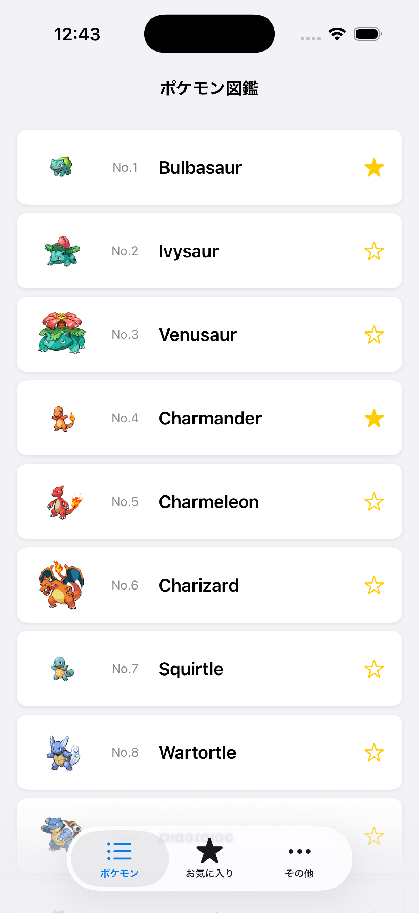

# 🌐 ワークショップ: サーバーと通信するモバイルアプリを作ってみよう！

このワークショップでは、ネットワーク通信を利用してデータを取得し、アプリに表示する機能を実装します。  
SwiftUI を使い、PokeAPI からポケモンのデータを取得し、それをリスト表示するポケモン図鑑アプリを作成します。



---

## 目標
- **サーバーと通信するアプリの仕組みを理解する**  
- **SwiftUI を使ってリスト表示を作成する**  
- **ForEach を使って動的にデータを表示する**  
- **URLSession を使って API からデータを取得する**  
- **取得したデータを Swift の構造体にマッピングする**  
- **画面遷移やタブを利用してアプリを整理する**

---

## 🐾 今回使う API: PokeAPI

このワークショップでは、**PokeAPI**（ポケエーピーアイ）という無料の API を使います。  
PokeAPI はポケモンの情報を提供してくれる公開 API で、誰でも自由に使うことができます。

🔗 **公式サイト**: https://pokeapi.co

### PokeAPI でできること

ブラウザで以下の URL にアクセスしてみてください。ポケモンのデータが JSON 形式で表示されます。

| やりたいこと | URL | 説明 |
|---|---|---|
| ポケモン一覧を取得 | https://pokeapi.co/api/v2/pokemon?limit=5 | 最初の5匹のポケモンの名前と URL |
| 1匹の詳細を取得 | https://pokeapi.co/api/v2/pokemon/25 | ピカチュウの詳細情報（タイプ、高さ、重さなど） |
| ポケモンの種族情報 | https://pokeapi.co/api/v2/pokemon-species/25 | ピカチュウの日本語名や図鑑説明文 |

### API ドキュメントの読み方

PokeAPI の公式サイトにはドキュメントが用意されています。

🔗 **ドキュメント**: https://pokeapi.co/docs/v2

ドキュメントには、どんな URL（**エンドポイント**）にアクセスすると、どんなデータが返ってくるかが書かれています。  
「もっとやってみよう」で機能を追加するときは、ドキュメントを読んで使えるデータを探してみましょう。

**ドキュメントの読み方のコツ:**
1. 左側のメニューから使いたい情報を選ぶ（Pokemon、Pokemon Species など）
2. **エンドポイント**（URL のパス）を確認する
3. **Response** のところを見て、どんなフィールド（データの項目）が返ってくるかを確認する
4. ブラウザで実際に URL にアクセスして、返ってくる JSON を見てみる

### このワークショップで使うエンドポイント

ワークショップの Step 3 以降で、以下の2つのエンドポイントを使います。

**1. ポケモン一覧の取得**
```
GET https://pokeapi.co/api/v2/pokemon?limit=151
```
初代151匹のポケモンの名前と URL の一覧が返ってきます。

**2. ポケモンの詳細情報の取得**
```
GET https://pokeapi.co/api/v2/pokemon/{id}
```
`{id}` の部分にポケモンの図鑑番号を入れると、そのポケモンのタイプ・高さ・重さなどの詳細情報が返ってきます。

---

## プロジェクトの構成

このワークショップでは、スタート用のプロジェクトを **ChallengeProjects** に、完成版の解答例を **CompletedProjects** に用意しています。

```
📁 ChallengeProjects/
  ├── 📂 NetworkedApp/                      # ワークショップのベースプロジェクト
  │   ├── NetworkedApp.xcodeproj
  │   ├── NetworkedApp/
  │   │   ├── NetworkedApp.swift          # アプリのエントリーポイント
  │   │   ├── PokemonListView.swift      # ポケモンのリスト画面
  │   │   ├── PokemonItemView.swift      # 1つのポケモンアイテムのビュー
  │   │   ├── PokemonDetailView.swift    # ポケモン詳細画面（未実装）
  │   │   ├── MainTabView.swift          # タブ画面（未実装）
  │   │   ├── Pokemon.swift              # ポケモンデータの構造体
  │   │   ├── Assets.xcassets/           # アセット管理
  │   ├── Documents/
  │   │   ├── Step0.md                   # Step 0 の説明資料
  │   │   ├── Step1.md                   # Step 1 の説明資料
  │   │   ├── Step2.md                   # Step 2 の説明資料
  │   │   ├── Step3.md                   # Step 3 の説明資料
  │   │   ├── Step4.md                   # Step 4 の説明資料
  │   │   ├── Step5.md                   # Step 5 の説明資料
  │
📁 CompletedProjects/
  ├── 📂 NetworkedApp/                   # 完成したプロジェクト
  │   ├── NetworkedApp.xcodeproj
  │   ├── NetworkedApp/
```

---

## プロジェクトの起動

まず、スタート用のプロジェクトを開いてみましょう。

### 1. Xcode でプロジェクトを開く
以下の手順で Xcode を起動します。

Finder で `ChallengeProjects/NetworkedApp/` を開いて、  
`NetworkedApp.xcodeproj` をダブルクリックしてください。

もしくはターミナルを開いて以下のコマンドを入力してください。


```sh
open ChallengeProjects/NetworkedApp/NetworkedApp.xcodeproj
```

---

## ワークショップの流れ

このワークショップでは、以下の流れでアプリを完成させます。

### Step 0: ベースコードを確認しよう
- プロジェクトのフォルダ構成を確認する。
- どのファイルが何をするのかを把握する。
- すでに書かれているコードを実行してみる。

➡️ [Step 0 - ベースコードを確認しよう](../ChallengeProjects/NetworkedApp/NetworkedApp/Documents/Step0.md)

---

### Step 1: アイテムセルを複数個縦に並べる
- `ScrollView` と `LazyVStack` を使って、ポケモンアイテムを複数並べる。
- データは直接コードに書いて（ハードコーディング）、リストの基本を理解する。

➡️ [Step 1 - アイテムセルを複数個縦に並べる](../ChallengeProjects/NetworkedApp/NetworkedApp/Documents/Step1.md)

---

### Step 2: ForEach を使ってリストを整理する
- `ForEach` を使って、リストをシンプルにする。
- 配列データを作成し、ForEach で動的に表示する。

➡️ [Step 2 - ForEach を使ってリストを整理する](../ChallengeProjects/NetworkedApp/NetworkedApp/Documents/Step2.md)

---

### Step 3: API からデータを取得する
- `URLSession` を使い、PokeAPI からデータを取得する。
- 取得した JSON を `PokemonListItem` 構造体に変換する。

➡️ [Step 3 - API からデータを取得する](../ChallengeProjects/NetworkedApp/NetworkedApp/Documents/Step3.md)

---

### Step 4: 画面遷移を実装する
- `NavigationStack` と `NavigationLink` を使って、ポケモンの詳細画面を表示する。

➡️ [Step 4 - 画面遷移を実装する](../ChallengeProjects/NetworkedApp/NetworkedApp/Documents/Step4.md)

---

### Step 5: タブをつける
- `TabView` を利用して、リスト画面とお気に入り画面を切り替えられるようにする。
- タブのアイコンを設定し、使いやすい UI にする。

➡️ [Step 5 - タブをつける](../ChallengeProjects/NetworkedApp/NetworkedApp/Documents/Step5.md)

---

## 完成版プロジェクト

すべてのステップが完了したら、完成版のプロジェクトを確認してみましょう。  
完成版のプロジェクトは `CompletedProjects/NetworkedApp/` に用意されています。

```sh
open CompletedProjects/NetworkedApp/NetworkedApp.xcodeproj
```

自分のコードと比較して、実装の違いを学んでみましょう。

---

## もっとやってみよう

このワークショップが終わったら、さらにアプリを改良してみましょう。  
気になるテーマを選んで、自分だけのポケモン図鑑を作ってみてください！

### 🌏 日本語対応にする
PokeAPI の `/pokemon-species/{id}` エンドポイントを使うと、ポケモンの日本語名や図鑑の説明文を取得できます。英語名の横に日本語名を表示したり、詳細画面に日本語の説明文を追加してみましょう。

### 🎴 カード風のデザインにこだわる
トレーディングカード風の UI にしてみましょう。ポケモンの画像を大きく表示し、タイプに応じた色（ほのお→赤、みず→青、くさ→緑など）をカードの背景に使うと、ぐっとかっこよくなります。角を丸くしたり、影をつけたり、光沢エフェクトを加えるとさらに本格的になります。

### 📜 無限スクロールを実装する
PokeAPI のレスポンスには `next` フィールドがあり、次のページの URL が入っています。リストの一番下までスクロールしたら、次の50匹を追加で読み込むようにしてみましょう。

### ⭐ お気に入りを保存する
`SwiftData` を使って、お気に入りのポケモンをアプリを閉じても残るようにしてみましょう。完成版プロジェクトに実装例があるので参考にしてください。

### ❓ クイズ機能を作る
- **シルエットクイズ**: ポケモンの画像を黒く塗りつぶして「だーれだ？」。正解すると元の画像が表示される演出をつけてみましょう
- **名前当てクイズ**: ポケモンの画像を見て、名前をテキスト入力して答える
- **タイプ相性クイズ**: 「みずタイプに強いのは？」を選択肢から選ぶ
- **鳴き声クイズ**: PokeAPI の `cries` フィールドの音声を再生して、誰の鳴き声か当てる

### 🔊 鳴き声を再生する
PokeAPI の `/pokemon/{id}` レスポンスには `cries` フィールドがあり、ポケモンの鳴き声の音声 URL が入っています。詳細画面に「鳴き声を聞く」ボタンを追加して、タップすると鳴き声が再生されるようにしてみましょう。`AVPlayer` を使うと URL から直接音声を再生できます。

### 📊 種族値をグラフで表示する
Swift Charts を使って、HP・こうげき・ぼうぎょなどの種族値をバーグラフやレーダーチャートで表示してみましょう。2匹のポケモンを並べて比較する機能も面白いです。

### 🎲 ランダムガチャ機能
ボタンを押すとランダムなポケモンが出る「ガチャ」を作ってみましょう。アニメーション演出をつけると楽しくなります。引いたポケモンをコレクションとして保存すれば、図鑑の完成度も表示できます。

### 📒 コレクション・図鑑完成度
見つけたポケモンを記録して、図鑑の完成度を ％ やプログレスバーで表示してみましょう。「あと何匹で全制覇！」のような表示があるとモチベーションが上がります。タイプごとの達成度を表示するのも面白いです。

### 📷 カメラで「ポケモン発見！」
カメラで撮った写真の上にポケモンの画像を合成して、「ポケモン発見！」風の写真を作ってみましょう。写真を保存したり、友達にシェアする機能も追加できます。

### 🗺 地図にポケモンの生息地を表示する
MapKit を使って、ポケモンの出身地方（カントー、ジョウトなど）を地図上にピンで表示してみましょう。ピンをタップするとその地方のポケモン一覧が見られると図鑑らしくなります。

### 🔗 シェア機能
`ShareLink` を使って、お気に入りのポケモン情報を友達に共有してみましょう。ポケモンの画像と名前、タイプをまとめたカードを共有できると便利です。

### 💡 自分だけのアイデアで作ってみよう！
ここに書いたテーマはほんの一例です。「こんな機能があったら面白いな」と思ったら、どんどん自由に作ってみましょう！正解はありません。自分だけのオリジナルポケモン図鑑を完成させてください！

---

お疲れ様でした！ 🎉

## 今後について

➡️ [次へ: 📚 さらに学んでみたい人へ](./09_further.md)
